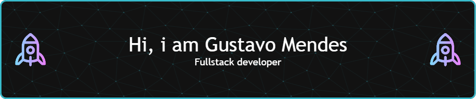

<h1 align="center">
  
</h1>

  
  
  

---

## 👋 Hey, I'm Gustavo Mendes!

💻 **Software Engineer at TCS**  
🚀 Passionate about creating scalable, high-quality software solutions.

As a Full Stack Developer, I specialize in building robust and scalable applications using technologies like **Node.js, AWS, Angular, React, Java, and Docker**. I have solid experience developing APIs, microservices, and front-end applications, as well as designing architecture that meets both technical and business needs.

I'm the creator of **[mendesscript.com](https://mendesscript.com)** — my tech space — and **[dateto.love](https://dateto.love)**, a side project that connects people in meaningful ways.

I enjoy working with international teams, solving complex problems, and continuously learning new technologies to improve both backend and frontend systems.

---

## 🛠️ Tech Stack & Tools

  
  
  
  
  
  
  
  
  
  
  

---

## 🌐 Projects & Websites

- 🚀 **[mendesscript.com](https://mendesscript.com)** — My personal tech blog, portfolio, and space to share knowledge.  
- 💖 **[dateto.love](https://dateto.love)** — A modern platform for connecting people and building meaningful relationships.

---

## 📊 GitHub Stats

  
  
  

---

## 🐍 Snake eating my commits

---

## 🚀 Let's Connect

Feel free to reach out via [LinkedIn](https://www.linkedin.com/in/gustavo-mendes-00661318b/) or visit my [website](https://mendesscript.com). I'm always open to discussing new projects, collaborations, or just talking about tech!

---

